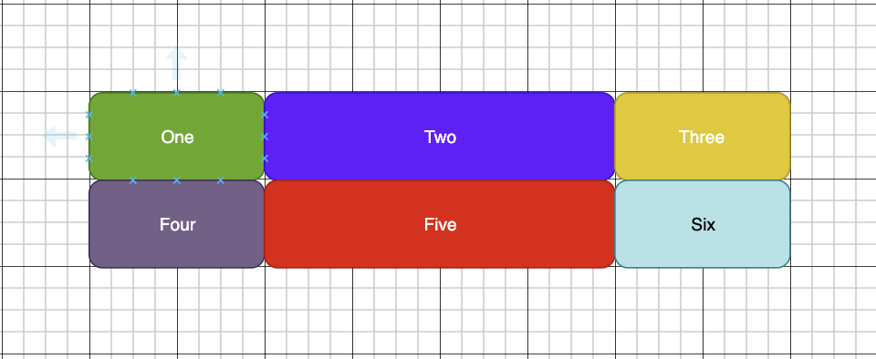
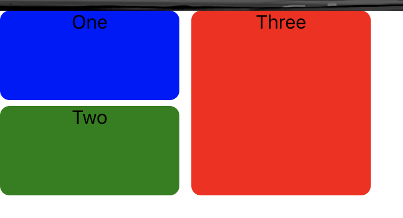
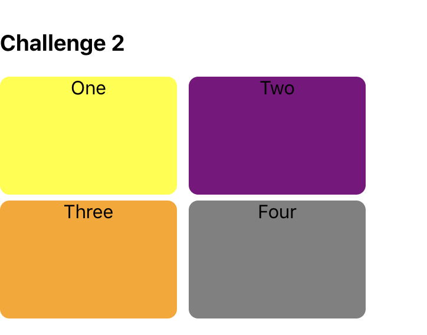
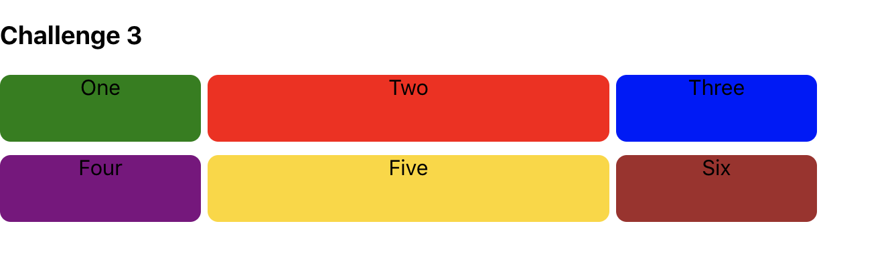
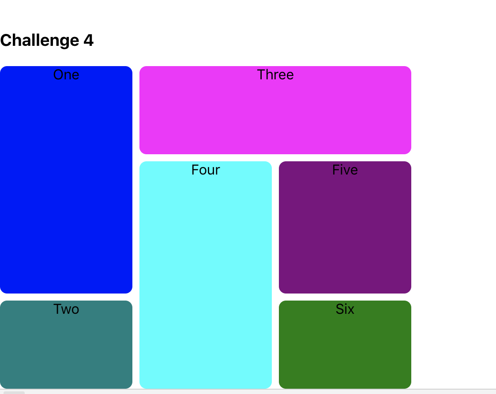

# Grids - A learning REPO

## Description

- This repo exists as a way to further investigate and practice my CSS grid skills.

- I have set myself a few challenges to complete:

  1. ~~A grid of 3 boxes - 2 on left, one above the other, one right taking whole column.~~

  2. ~~A grid of 4 boxes each taking up the same area~~

  3. ~~A grid of 6 boxes in a grid of varying column size~~
    

  4. ~~A grid of 6 boxes with varying row size each spanning multiple rows or columns.~~

  4.1. Nest Current challenges in a new parent grid. 

  5. A grid of 3 boxes, onClick will open a new box.

  6. onClick opens a new box without affecting the position of the other boxes.

  7. onClick opens a new div with a nested Grid.

  8. A second Onclick function that adds something to the nested grid.

  9. 8, but with no other div being affected.

## Approach

  There is not much of an approach to this project other than completing the challenges set for myself and any other challenges I conjure during.

  Importantly in a break from my other Projects I will not:
- Test in any way shape or form.
- Semantic Commits will be gone.
- SOLID does not exist in this repo
- Clean Code is not relevant here as repetition is key to learning.

## Progress

As I progress with these challenges I will write accounts or insert images of the completed challenge.

1.

  

  - Challenge completed using a simple Grid -
      - 3 column Lines! = 2 Columns!
      - 3 Row Lines = 2 full rows!
  - Added Border radius 8px to make curve
  - Added grid-column/row-gap of 10px & 5px.
  - N.B black border at top is from chrome browser NOT css.

2.

  

  - Challenge completed using same grid as above
  - Used the simpler grid-column / grid-row definition for grid placement rather than grid-column/row-start/end
  - Each grid will be loaded into its own Challenge CSS file so all challenges CSS is kept separate.

3.

  

  - Basically replicating the CSS grid docs example.
  - Continued use of the shorthand notation of column/row
  - Changed to 6 boxes for challenge description as is a better fit for the actual challenge.
  - Column lengths are: 150px, 300px, 150px
  - Rows standard at 50px

4.

  

  - Used the repeat notation to define columns, note the 1st argument in the repeat function is the number of COLUMNS not lines created.
  - Used 6 Divs, and placed them to take up multiple rows and columns. Using four was too similar to challenge 3.
  - All colours used so far use the name as a string rather than HTML colour picker # code
